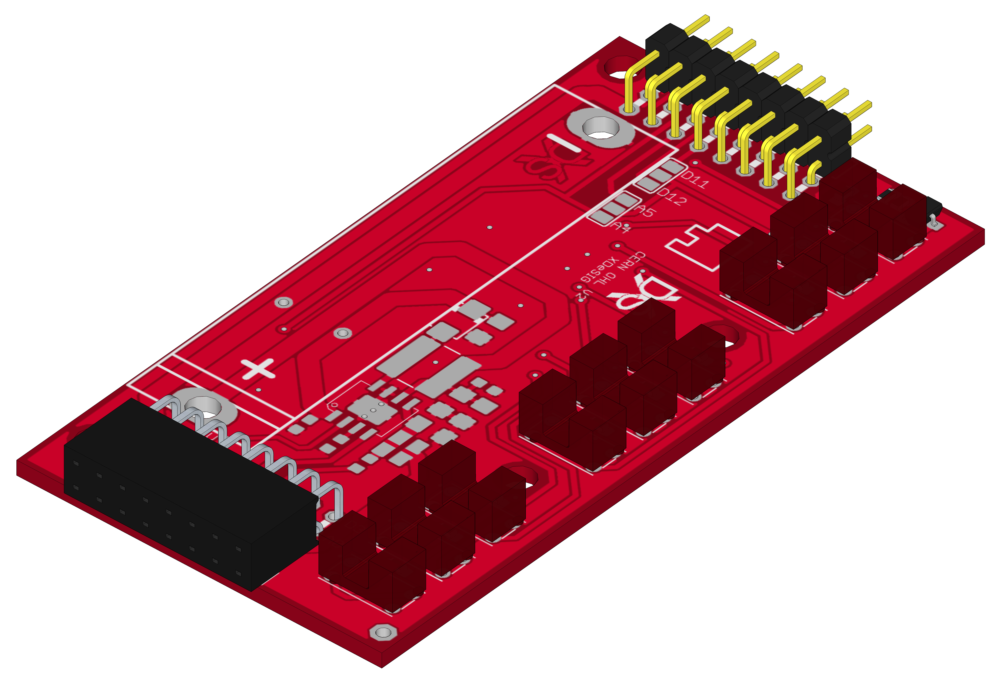
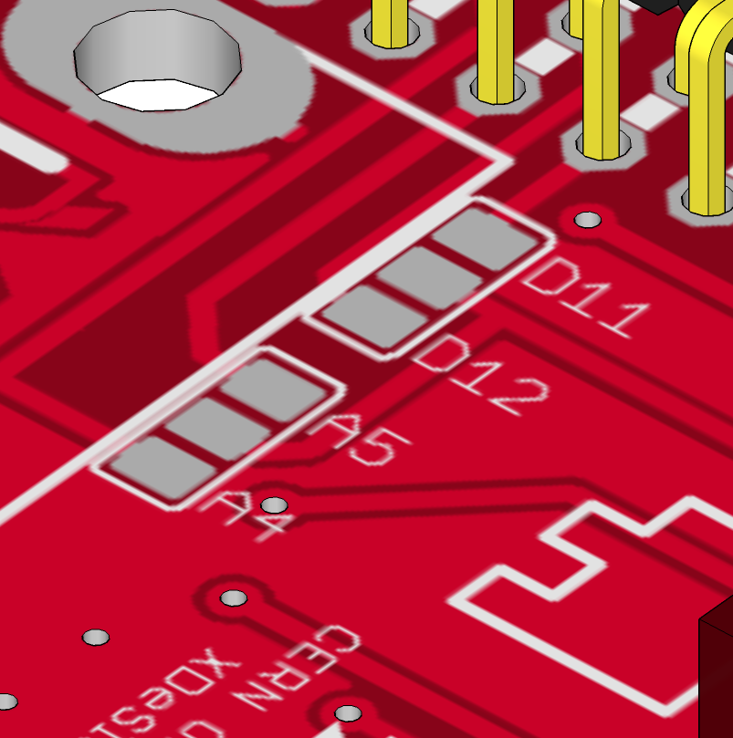
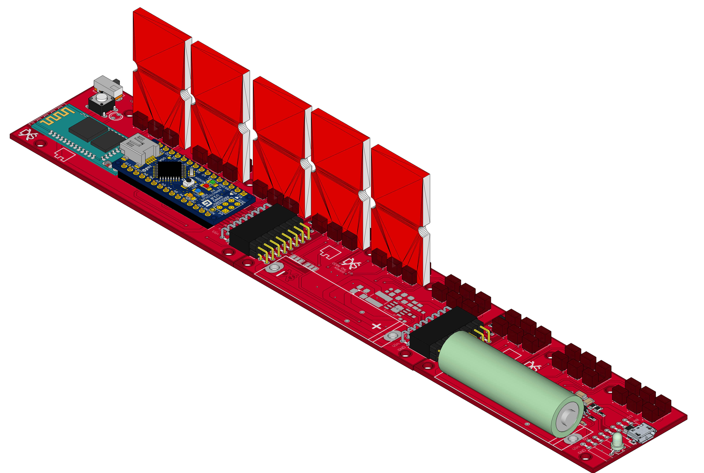

## E_KEY_FICHA (Tag)
It allows the programming of Escornabot using printed or cut-out cards (cardboard ..) communicating the commands via Bluetooth 
using @arduino Nano, easy to print, manageable and expandable to 15 "Tabs" thanks to the firmware of @caligari_pub.
   

## Number of Tags (Fichas)
To use six tags we need the PCBs E_KEY_T_1_V and E_KEY_T_2_V the latter with the power components.

 If we want to have more chips (9 to 15) we will put intermediate circuits E_KEY_T_2_V without the power supply electronics.

The selection will always be configured on the end plates, according to the firmware.

## License

Every content in this repo, otherwise specified under subdirectories, is
licensed under [Creative Commons BY-SA][LICENSEcc] or [CERN Open Hardware Licence -W- V2][OHL-W-V2].
(by [XDeSIG][XDE01])

## To buy boards

Developer don't produce boards to sell. Under [_provider_][provider]
directory there are instructions to order yourself.

Are you a board provider? Please, send us your buyer's guide! :-)

[imax]: https://github.com/xdesig/escornabot-electronics/blob/master/Electronics/E_KEY_BT/IMG_20180619_093516.jpg

[XDE01]: https://twitter.com/xdesig
[provider]:  http://
[LICENSEcc]: https://creativecommons.org/licenses/by-sa/3.0/es
[OHL-W-V2]: https://ohwr.org/project/cernohl/wikis/Documents/CERN-OHL-version-2
